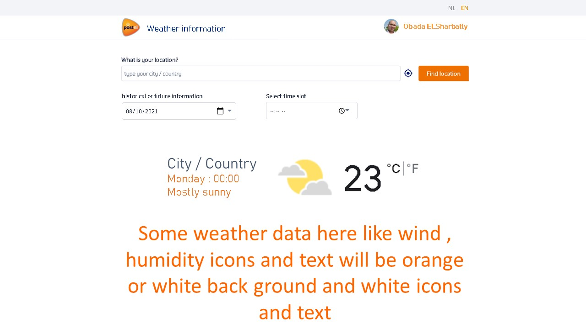

# (API) weather App project

## Scetch design:

## Check the project webpage:
You can test the app from [here](https://obadaelsharbatly.github.io/Weather-APP-HYF/):

## App features *(content will be modified after finishing the app)*:
**It's a weather app which can give you information about the wewather condition
for current time besides past and future. I will follow the [PostNL](https://www.postnl.nl/en/) website style and gonna use [Weather api](https://www.weatherapi.com/) website to get weather information**

  ### Must have features:
  * Design of the app should fits the [PostNL](https://www.postnl.nl/en/) website style.
  * The weather information at least should show:
     * Location name
     * Time
     * Weather condition
     * Sample logo of weather
     * Changeble temperature
  * User can search about different locations.
  * User can know the weather of ten days in the future.
  * User can know weather information for past days.
  * User can change the time to know the weather during the day.

  ### nice to have features:
  * Automatically give the user information about current location.
  * User can present the data in different language.
  * Design different background images fit's with [PostNL](https://www.postnl.nl/en/) website style and make it change with temperature.
  * Make special design for mobile like aside menu.
  
